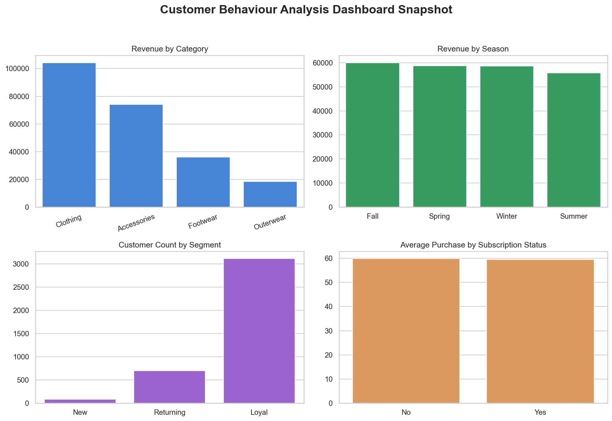

# Customer Behaviour Analysis


Retail analytics case study using Python, SQL, Streamlit, and Power BI artifacts to analyze customer shopping behavior and revenue patterns.

## Problem Statement

Retail teams need to understand which product categories, customer segments, seasons, and purchase behaviors drive revenue. This project analyzes customer shopping data to identify business insights that can support merchandising, marketing, and customer retention decisions.

## Dataset

The dataset is stored in `data/customer_shopping_behavior.csv` and includes customer demographics, product category, purchase amount, location, season, subscription status, discount usage, previous purchases, payment method, and purchase frequency.

## Tools

- Python
- Pandas and NumPy
- Matplotlib and Seaborn
- SQL
- Streamlit
- Power BI (`reports/customer_behavior_dashboard.pbix`)
- Pytest

## Workflow

1. Load the customer shopping dataset.
2. Standardize column names into snake_case.
3. Remove duplicate records and validate purchase amount values.
4. Engineer customer segments from previous purchase counts.
5. Analyze revenue by category, season, location, subscription status, and purchase frequency.
6. Present insights through Streamlit, SQL queries, and existing Power BI/report artifacts.

## Key Insights

- Category-level revenue highlights the strongest merchandise groups.
- Customer segmentation separates new, returning, and loyal shoppers for targeted marketing.
- Subscription status and discount usage can be compared against average purchase amount.
- Seasonal revenue patterns can guide campaign timing and inventory planning.

More details are available in [`reports/insights.md`](reports/insights.md).

## Business Impact

The project translates raw transaction data into business questions a retail team can use: which categories perform best, which customer groups are more valuable, and how purchasing behavior changes across season, discount usage, and subscription status.

## Dashboard Screenshot



## Power BI / Report Artifacts

This repository includes actual report artifacts:

- `reports/customer_behavior_dashboard.pbix`
- `reports/Customer Shopping Behavior Analysis.pdf`
- `reports/Customer-Shopping-Behavior-Analysis.pptx`
- `reports/Business Problem Document.pdf`

## How to Run

```bash
pip install -r requirements.txt
streamlit run app.py
```

Run tests:

```bash
pytest -q
```

SQL queries are available in [`src/customer_analysis.sql`](src/customer_analysis.sql).

## Folder Structure

```text
.
├── app.py
├── data/
├── docs/
├── reports/
│   └── insights.md
├── screenshots/
├── src/
├── tests/
├── README.md
└── requirements.txt
```

## Future Scope

- Add Power BI exported dashboard screenshots.
- Add cohort analysis if transaction dates become available.
- Add customer lifetime value modeling if longitudinal purchase data is added.
- Build repeat-purchase prediction if a clear target variable is defined.
